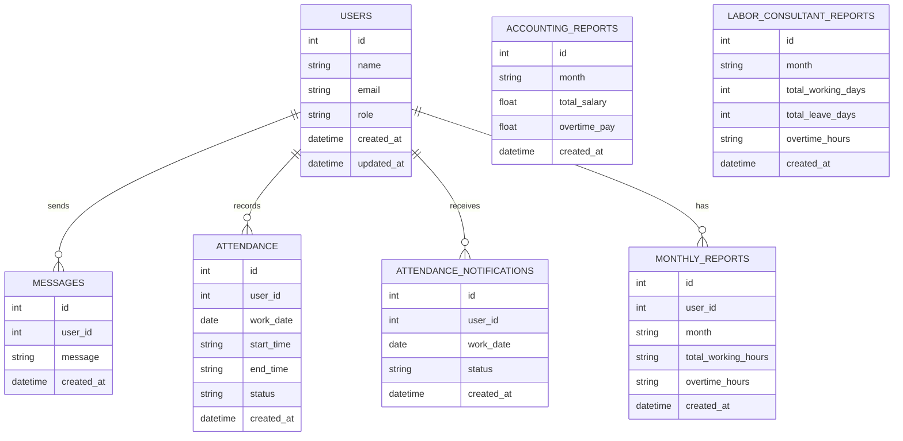

# 勤怠管理付きチャットシステム ER 図

```mermaid
erDiagram
    USERS {
        int id
        string name
        string email
        string role
        datetime created_at
        datetime updated_at
    }

    MESSAGES {
        int id
        int user_id
        string message
        datetime created_at
    }

    ATTENDANCE {
        int id
        int user_id
        date work_date
        string start_time
        string end_time
        string status
        datetime created_at
    }

    ATTENDANCE_NOTIFICATIONS {
        int id
        int user_id
        date work_date
        string status
        datetime created_at
    }

    MONTHLY_REPORTS {
        int id
        int user_id
        string month
        string total_working_hours
        string overtime_hours
        datetime created_at
    }

    ACCOUNTING_REPORTS {
        int id
        string month
        float total_salary
        float overtime_pay
        datetime created_at
    }

    LABOR_CONSULTANT_REPORTS {
        int id
        string month
        int total_working_days
        int total_leave_days
        string overtime_hours
        datetime created_at
    }

    USERS ||--o{ MESSAGES : sends
    USERS ||--o{ ATTENDANCE : records
    USERS ||--o{ ATTENDANCE_NOTIFICATIONS : receives
    USERS ||--o{ MONTHLY_REPORTS : has
```
