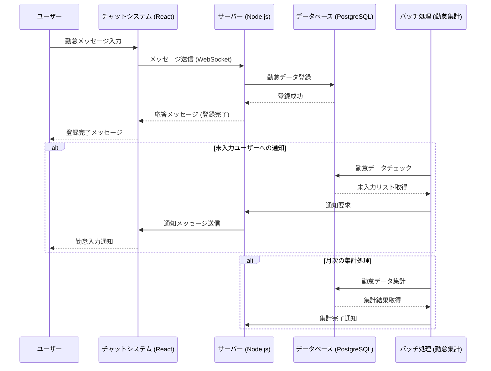

```mermaid
sequenceDiagram
    participant User as ユーザー
    participant ChatSystem as チャットシステム (React)
    participant Server as サーバー (Node.js)
    participant DB as データベース (PostgreSQL)
    participant Scheduler as バッチ処理 (勤怠集計)

    User->>ChatSystem: 勤怠メッセージ入力
    ChatSystem->>Server: メッセージ送信 (WebSocket)
    Server->>DB: 勤怠データ登録
    DB-->>Server: 登録成功
    Server-->>ChatSystem: 応答メッセージ (登録完了)
    ChatSystem-->>User: 登録完了メッセージ

    alt 未入力ユーザーへの通知
        Scheduler->>DB: 勤怠データチェック
        DB-->>Scheduler: 未入力リスト取得
        Scheduler->>Server: 通知要求
        Server->>ChatSystem: 通知メッセージ送信
        ChatSystem-->>User: 勤怠入力通知
    end

    alt 月次の集計処理
        Scheduler->>DB: 勤怠データ集計
        DB-->>Scheduler: 集計結果取得
        Scheduler->>Server: 集計完了通知
    end
```
