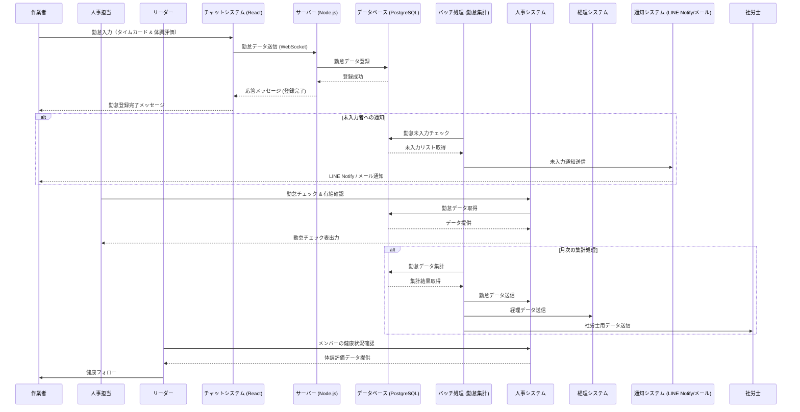

```mermaid
sequenceDiagram
    participant Worker as 作業者
    participant HR as 人事担当
    participant Leader as リーダー
    participant ChatSystem as チャットシステム (React)
    participant Server as サーバー (Node.js)
    participant DB as データベース (PostgreSQL)
    participant Scheduler as バッチ処理 (勤怠集計)
    participant HRSystem as 人事システム
    participant Payroll as 経理システム
    participant Notifier as 通知システム (LINE Notify/メール)
    participant LaborOffice as 社労士

    Worker->>ChatSystem: 勤怠入力（タイムカード & 体調評価）
    ChatSystem->>Server: 勤怠データ送信 (WebSocket)
    Server->>DB: 勤怠データ登録
    DB-->>Server: 登録成功
    Server-->>ChatSystem: 応答メッセージ (登録完了)
    ChatSystem-->>Worker: 勤怠登録完了メッセージ

    alt 未入力者への通知
        Scheduler->>DB: 勤怠未入力チェック
        DB-->>Scheduler: 未入力リスト取得
        Scheduler->>Notifier: 未入力通知送信
        Notifier-->>Worker: LINE Notify / メール通知
    end

    HR->>HRSystem: 勤怠チェック & 有給確認
    HRSystem->>DB: 勤怠データ取得
    DB-->>HRSystem: データ提供
    HRSystem-->>HR: 勤怠チェック表出力

    alt 月次の集計処理
        Scheduler->>DB: 勤怠データ集計
        DB-->>Scheduler: 集計結果取得
        Scheduler->>HRSystem: 勤怠データ送信
        Scheduler->>Payroll: 経理データ送信
        Scheduler->>LaborOffice: 社労士用データ送信
    end

    Leader->>HRSystem: メンバーの健康状況確認
    HRSystem-->>Leader: 体調評価データ提供
    Leader->>Worker: 健康フォロー
```
